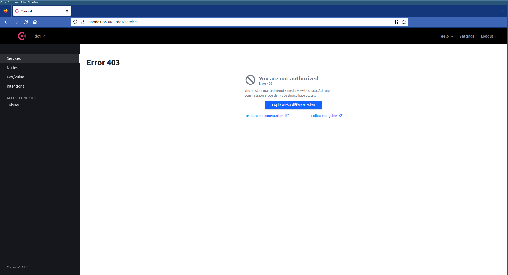

# Kwuxlab / Ansible

Ansible playbooks to configure your compute cluster.

1. [Basic compute environment configuration](#basic-compute-environment-configuration),
including basic security/quality-of-life settings:
   - [x] :heavy_check_mark: [Non-root sudoer user creation](/ansible/playbooks/kwuxlab_ansible_common_base)
   - [x] :heavy_check_mark: [Log-rotation & Journalctl max disk usage settings](/ansible/playbooks/kwuxlab_ansible_common_base)
   - [x] :heavy_check_mark: [Timezone/NTP installation/configuration to avoid time-drift](/ansible/playbooks/kwuxlab_ansible_common_base)
   - [x] :heavy_check_mark: [Base firewall configuration](/ansible/playbooks/kwuxlab_ansible_common_base) via the Uncomplicated Firewall ([UFW](https://wiki.ubuntu.com/UncomplicatedFirewall))
   - [x] :heavy_check_mark: [Secure SSH configuration](/ansible/playbooks/kwuxlab_ansible_common_ssh_rules)
   - [ ] :no_entry_sign: [Basic OS Hardening](/ansible/playbooks/kwuxlab_ansible_common_os_hardening)
   - [x] :heavy_check_mark: [Hostname configuration](/ansible/playbooks/kwuxlab_ansible_common_hostname)
   - [x] :heavy_check_mark: [Tailscale installation & bootstrapping](/ansible/playbooks/kwuxlab_ansible_common_tailscale)
   - [x] :heavy_check_mark: [Docker installation & base configuration](/ansible/playbooks/kwuxlab_ansible_common_docker)
   - [x] :heavy_check_mark: [Python/python3-pip installation/configuration](/ansible/playbooks/kwuxlab_ansible_common_pip)
2. 

## Base host configuration & requirements

### Supported OS

- [x] Ubuntu
   - [ ] 18.04 (previously worked, but DNS configuration failed recently)
   - [x] 20.04 (tested using Hetzner's standard image)

### Pre-requisites

1. Create the kwuxlab cluster infrastructure (machines) by following the directions
in [the infrastructure directory of this repository](/infrastructure).
2. Create, and configure, a tailscale account.
We'll use tailscale to access our hosts via a private network.
   1. Install and authenticate to Tailscale. See the
      [Tailscale getting started tutorial](https://tailscale.com/kb/1017/install/) for details.
   2. Enable [MagicDNS](https://tailscale.com/kb/1081/magicdns/).
   3. Create a **reusable** Tailscale Auth key.
      See the Tailscale [Auth key documentation](https://tailscale.com/kb/1085/auth-keys/) for details.
3. Install and configure (authenticate) [tailscale](https://tailscale.com) 
   on your local machine. 
   - This will enable you to connect directly to the machines over tailscale's 
     network, which will be necessary for some of the ansible playbooks listed below.
   - This will also enable you to access your tailscale node's services directly!
4. Copy the `./inventories/test` inventory directory to `./inventories/dev`.

   ```sh
   # Enter this project's ansible directory
   cd ~/projects/kwuxlab/ansible

   # Copy the test inventory directory to a dev environment location
   cp -r ./inventories/test ./inventories/dev
   ```

5. Use your favorite text editor to edit/replace the target host ip(s) in the
`./inventories/dev/hostip.ini` file to match your kwuxlab machine ips.
   - If you created your machines on a cloud hosting provider, via terragrunt, you can
     run the `terragrunt output` command from the same directory that you ran `terragrunt apply`,
     to re-output the details associated with the machines, including their IP addresses.

     Ensure that the `consul_servers` group receives the "server node" ips, and that the
     `consul_clients` group receives the "client node" ip(s).
     
     ```sh
     # Enter the appropriate directory, e.g.:
     cd ~/projects/kwuxlab/infrastructure/terragrunt/hetzner/non-prod/dev/hcloud/kwuxlab_cluster

     # Run the terragrunt output command
     terragrunt output
     ```

6. Install and configure requirements for Ansible and this project on your host
machine (*i.e.* your local computer).

   1. Python3 must be installed.
      - If you're unfamiliar with Python, I encourage you to read the documentation at
        [virtualenv](https://virtualenv.pypa.io/en/latest/). Virtualenv will allow you
        to create a virtual python environment for the kwuxlab.
   2. Install this project's python requirements

      ```sh
      # Enter this project's ansible directory
      cd ~/projects/kwuxlab/ansible

      # Install python dependencies
      pip install -r requirements.txt
      ```

### Basic compute environment configuration

All of the steps below are context-dependent, and expect that your
terminal's current directory, while running the commands, is `kwuxlab/ansible`.

1. Create a `password_file.{env}.txt` (replacing `{env}` with *e.g.* `dev`) for your environments,
   to use with
   `ansible-vault` encryption. There is no special command to create this
   file/password, choose whatever password suits your needs. Here's an example using
   `ruby`:

   ```sh
   # Enter this project's ansible directory
   cd ~/projects/kwuxlab/ansible

   # Note, by default, this is gitignored in this repository.
   # For alternative methods/options, check out the docs at
   # https://docs.ansible.com/ansible/latest/user_guide/vault.html
   ruby -rsecurerandom -e 'puts SecureRandom.hex(30)' >> password_file.dev.txt
   ```

2. Configure variables required by these playbooks:
   1. [kwuxlab_ansible_common_tailscale](./playbooks/kwuxlab_ansible_common_tailscale)

      ```sh
      # 1. Set the target env (or inline it).
      export KWUXLAB_ENV="dev"

      # 2. Copy the example environment file to your target env, e.g.
      cp playbooks/kwuxlab_ansible_common_tailscale/vars/example_environment.yml \
         playbooks/kwuxlab_ansible_common_tailscale/vars/dev_environment.yml

      # 3. Encrypt the file
      ansible-vault encrypt \
            --vault-id password_file."${KWUXLAB_ENV}".txt \
            playbooks/kwuxlab_ansible_common_tailscale/vars/"${KWUXLAB_ENV}"_environment.yml

      # 4. Edit the file, updating the required variables.
      ansible-vault edit \
            playbooks/kwuxlab_ansible_common_tailscale/vars/"${KWUXLAB_ENV}"_environment.yml \
            --vault-password-file password_file."${KWUXLAB_ENV}".txt
      ```
      
      - See the README at [kwuxlab_ansible_common_tailscale](./playbooks/kwuxlab_ansible_common_tailscale/README.md)
        for additional details about the variables listed!
 
   2. [kwuxlab_ansible_common_base](./playbooks/kwuxlab_ansible_common_base)
      - If your local machine will use a public/private key-pair other than
        `~/.ssh/id_ed25519` and `~/.ssh/id_ed25519.pub`, edit the `target_public_key_filename`
        variable in the `./playbooks/kwuxlab_ansible_common_base/vars.yml` as needed!
      - See the README at [kwuxlab_ansible_common_base](./playbooks/kwuxlab_ansible_common_base/README.md)
        for additional details about the variables listed!

3. Run the `configure` master playbook

   > NOTE: This command will execute two master playbooks. The first, [configure_base.yml](./configure_base.yml)
   >       will run as the `root` user, and among other things, will disable root SSH, and create a user called
   >       `kwuxlab_ansibler` (by default).
   > 
   >       It will then execute the [configure.yml](./configure.yml) as the `kwuxlab_ansibler` user.

   ```sh
   # 1. Set the target env (or inline it)
   export KWUXLAB_ENV="dev"

   # 2. Optional: override the target private-key used for authentication (default is ~/.ssh/id_ed25519)
   # export PRIVATE_KEY="~/.ssh/id_rsa"
   #    - NOTE: If exporting this variable, also ensure that the `target_public_key_filename`
   #            variable is changed at
   #            ansible/playbooks/kwuxlab_ansible_common_base/vars.yml

   # 3. Run the ansible configure playbook 
   bin/configure
   ```

4. Accept authenticity of the remote (or Vagrant) hosts (if required).

   > NOTE: You may need to enter 'yes' multiple times, and,
   > if the playbook execution looks 'stuck', it's likely waiting for input
   > (enter `yes` and press `enter`):

   ```sh
   [WARNING]: Found variable using reserved name: remote_user
   
   PLAY [Include global vars] ************************************************************************************************************************************************************************************************************
   The authenticity of host '192.168.56.3 (192.168.56.3)' can't be established.
   ECDSA key fingerprint is SHA256:9asdwJklaa0sd9fuasdfAajklszlkcalskdjf.
   Are you sure you want to continue connecting (yes/no)? yes
   ```
   
5. Once the playbook completes, confirm that it was a success:
   1. Log into your [Tailscale dashboard](https://login.tailscale.com/admin/machines),
      and confirm that you see 4 nodes, in addition
      to your local machine.

      

   2. Confirm that you are able to ssh into the nodes, using their tailscale machine names.
      If you're unable to connect, but see the nodes in the dashboard from the previous step,
      ensure that you've configured [Tailscale MagicDNS](https://tailscale.com/kb/1081/magicdns/).
      
      Enabling that (if not enabled) should resolve your issues!

      ```sh
      ssh kwuxlab_ansibler@tsnode1
      kwuxlab_ansibler@tsnode1:~$ 
      ```

## Base (Hashicorp Consul/Vault + Envoy) Services installation

### Pre-requisites

1. The dev environment provided (and the corresponding
`./inventories/dev/tailscale.ini`) has been configured expecting that you have
enabled [Tailscale's MagicDNS feature](https://tailscale.com/kb/1081/magicdns/)
(currently in beta). Enable this in your account in order to reference nodes
by their tailscale machine name / hostname!
   - If you'd rather not enable MagicDNS, simply swap out the `target_hostname`
   variable in the `./inventories/dev/tailscale.ini` file for the tailscale IP
   (note: this configuration is untested).

2. Ensure that the `KWUXLAB_ENV` and `PRIVATE_KEY` environment variables are
   set.
   ```sh
   # 1. Set the target env (or inline it)
   export KWUXLAB_ENV="dev"

   # 2. Optional: override the target private-key used for authentication (default is ~/.ssh/id_ed25519)
   # export PRIVATE_KEY="~/.ssh/id_rsa"
   ```
3. Ensure that the previous steps completed correctly, and that all nodes
   are connected to the tailscale network.
   ```
   $ tailscale status
   100.70.123.123  tsnode1              mytailscaleusername@ linux   active; direct 1.23.45.67:41641, tx 10248284 rx 4311460
   100.70.123.124  tsnode2              mytailscaleusername@ linux   -
   100.70.123.125  tsnode3              mytailscaleusername@ linux   -
   100.70.123.126  tsnode4              mytailscaleusername@ linux   -
   ```

### Service installation

Next, we'll provision, in a particular order-of-operations, our base services!


#### 1. Envoy

[Envoy](https://www.envoyproxy.io/) is,
"an open source edge and service proxy, designed for cloud-native applications."

##### Pre-requisites

##### Deploy

All of the steps below are context-dependent, and expect that your
terminal's current directory, while running the commands, is `kwuxlab/ansible`.

1. Provision the `envoy` service across all nodes, for use with [Consul's 
   Service Mesh](https://developer.hashicorp.com/consul/docs/connect)
   capabilities (also called Consul Connect).
   ```sh
   # Current directory: kwuxlab/ansible
   SERVICE=envoy bin/provision-service
   ``` 

#### 2. Consul

Hashicorp [Consul](https://www.consul.io/) will act as our foundational network
and service layer, monitoring node state, communication, and acting as a 
light distributed data store for some of our services (*e.g.* Vault).

##### Pre-requisites

1. Copy the `ansible/playbooks/kwuxlab_ansible_service_consul/vars/example_environment.yml`
   file to `ansible/playbooks/kwuxlab_ansible_service_consul/vars/dev_environment.yml`.

   ```sh
   # Enter this project's ansible directory
   cd ~/projects/kwuxlab/ansible
   
   # Set the target env (or inline it).
   export KWUXLAB_ENV="dev"

   # Copy the `example` environment variables file to a `dev` environment file
   # NOTE: `dev` matches our expected KWUXLAB_ENV variable value as set above.
   cp playbooks/kwuxlab_ansible_service_consul/vars/example_environment.yml \
      playbooks/kwuxlab_ansible_service_consul/vars/"${KWUXLAB_ENV}"_environment.yml
   ```

2. Encrypt the newly created variable file
   ```sh
   ansible-vault encrypt \
      --vault-id password_file."${KWUXLAB_ENV}".txt \
      playbooks/kwuxlab_ansible_service_consul/vars/"${KWUXLAB_ENV}"_environment.yml
   ```

3. Edit the new variable file, updating the required variables.
   ```sh
   ansible-vault edit \
      playbooks/kwuxlab_ansible_service_consul/vars/"${KWUXLAB_ENV}"_environment.yml \
      --vault-password-file password_file."${KWUXLAB_ENV}".txt
   ```
   - See the README at [kwuxlab_ansible_service_consul](./playbooks/kwuxlab_ansible_service_consul/README.md)
     for additional details about the variables listed!

##### Deploy

All of the steps below are context-dependent, and expect that your
terminal's current directory, while running the commands, is `kwuxlab/ansible`.

1. Provision the `consul` service across all nodes
   ```sh
   # Current directory: kwuxlab/ansible
   SERVICE=consul bin/provision-service
   ``` 

2. At the command-line, SSH into any of the consul **server** nodes:
   ```sh
   ssh kwuxlab_ansibler@tsnode1
   ```
3. And, let's verify that service discovery via DNS is configured correctly:
   ```sh
   # Let's look up the DNS entries for the consul service.
   # Remember that only the `consul server` nodes are actually running the
   # service. Our `client` node is not on this list, as is expected.
   kwuxlab_ansibler@tsnode1:~$ nslookup consul.service.consul
   Server:         127.0.0.53
   Address:        127.0.0.53#53

   Non-authoritative answer:
   Name:   consul.service.consul
   Address: 100.70.123.123
   Name:   consul.service.consul
   Address: 100.70.123.124
   Name:   consul.service.consul
   Address: 100.70.123.125
   ```  
4. Next, we'll need to extract our `initial-management`, or `master` token:
   ```sh
   $ sudo cat /var/lib/consul/config.json | grep initial_management
   >             "initial_management": "8cdd6379-baee-5fec-8de7-f30253647e7c",
   ```
   - NOTE: I recommend saving this output in an external password manager
     for later reference.

5. With the `initial-management` token, we can now bootstrap Consul's ACL policies.

   We'll be executing the following commands on the same node you're already
   SSH'd into!

   1. First, ensure that the `CONSUL_HTTP_TOKEN` environment variable is set to
      the value of the `initial_management` token we saw in the previous step:
      ```sh
      # NOTE: ideally the token itself would be sourced from the environment,
      # as using it in the command-line - as shown below - places it in your
      # shell's history!
      export CONSUL_HTTP_TOKEN="8cdd6379-baee-5fec-8de7-f30253647e7c"
      ```
   2. Next, let's check out the status of our members. Note that the IP addresses
      match the nodes' assigned tailscale addresses, as the services are running
      on, and bound to, the tailscale network.
      ```sh
      $ consul members
      Node     Address              Status  Type    Build   Protocol  DC   Partition  Segment
      tsnode1  100.70.123.123:8301    alive   server  1.11.4  2         dc1  default    <all>
      tsnode2  100.70.123.124:8301    alive   server  1.11.4  2         dc1  default    <all>
      tsnode3  100.70.123.125:8301    alive   server  1.11.4  2         dc1  default    <all>
      tsnode4  100.70.123.126:8301    alive   client  1.11.4  2         dc1  default    <default>
      ```

   3. Now we're ready to create an ACL token belonging to the built-in ACL policy
      [global-management](https://developer.hashicorp.com/consul/docs/security/acl/acl-policies#global-management).
      
      This token will act as our Administrative access token, and should be used in most
      scenarios where you may want to lean on the privileges afforded by the master token.
 
      ```sh
      $ consul acl token create -policy-name=global-management
      AccessorID:       c643c06a-fe17-6958-5e84-189380514d71
      SecretID:         58b39ecd-614c-5094-a4ae-c4db5c08e496
      Description:      
      Local:            false
      Create Time:      2022-11-15 12:11:14.315531659 -0600 CST
      Policies:
      00000000-0000-0000-0000-000000000001 - global-management
      ```
      
      What we're interested in is the `SecretID` value: that's your token!
 
      - NOTE: I recommend saving this output in an external password manager
        for later reference.

6. Open a browser, and visit the [Consul UI](http://tsnode1:8500/ui/) at
   `http://tsnode1:8500/ui/` 

   You should see a page like:

   

   Go ahead and log-in using the management ACL token we generated in the 
   previous step (`58b39ecd-614c-5094-a4ae-c4db5c08e496` in the example above).

   - Under the `Services` tab, you should see three nodes running the `consul`
     service. These are your `consul server` nodes!
      
   - Under the `Nodes` tab, you should see all four nodes - including the `consul client`
     node!
      


#### 3. Vault

Hashicorp [Vault](https://www.vaultproject.io/),
"secures, stores, and tightly controls access to tokens, passwords,
certificates, API keys, and other secrets in modern computing."

##### Pre-requisites

1. Copy the `ansible/playbooks/kwuxlab_ansible_service_vault/vars/example_environment.yml`
   file to `ansible/playbooks/kwuxlab_ansible_service_vault/vars/dev_environment.yml`.

   ```sh
   # Enter this project's ansible directory
   cd ~/projects/kwuxlab/ansible
   
   # Set the target env (or inline it).
   export KWUXLAB_ENV="dev"

   # Copy the `example` environment variables file to a `dev` environment file
   # NOTE: `dev` matches our expected KWUXLAB_ENV variable value as set above.
   cp playbooks/kwuxlab_ansible_service_vault/vars/example_environment.yml \
      playbooks/kwuxlab_ansible_service_vault/vars/"${KWUXLAB_ENV}"_environment.yml
   ```

2. Encrypt the newly created variable file
   ```sh
   ansible-vault encrypt \
      --vault-id password_file."${KWUXLAB_ENV}".txt \
      playbooks/kwuxlab_ansible_service_vault/vars/"${KWUXLAB_ENV}"_environment.yml
   ```

3. Edit the new variable file, updating the required variables.
   ```sh
   ansible-vault edit \
      playbooks/kwuxlab_ansible_service_vault/vars/"${KWUXLAB_ENV}"_environment.yml \
      --vault-password-file password_file."${KWUXLAB_ENV}".txt
   ```
   - See the README at [kwuxlab_ansible_service_vault](./playbooks/kwuxlab_ansible_service_vault/README.md)
     for additional details about the variables listed!
     - Note: the `SecretID` part of the `global-management` token we generated 
       above is what you'll want to set the `consul_acl_key` to for this tutorial.
     
       However, a more [specific policy](https://developer.hashicorp.com/vault/docs/configuration/storage/consul)
       is better!

##### Deploy

All of the steps below are context-dependent, and expect that your
terminal's current directory, while running the commands, is `kwuxlab/ansible`.

1. Provision the `vault` service across all nodes
   ```sh
   # Current directory: kwuxlab/ansible
   SERVICE=vault bin/provision-service
   ``` 

##### Initialize

1. Open a browser, and visit the [Consul UI](http://tsnode1:8200) at
   `http://tsnode1:8200`
   
   You should be greeted with a similar screen to this:

   

2. Configure the details used in generating/managing the master key!
   - Enter a number of key-shares to divide the master key into. 
      - *e.g.* `10`
   - Enter a key threshold: the number of keys required in order to reconstruct
      the master key. 
     - *e.g.* `5`
   - More details on key shares and thresholds [here](https://developer.hashicorp.com/vault/docs/concepts/seal#shamir-seals)

3. Once you've entered your desired share/threshold values, and clicked 
   "Initialize", you'll be greeted with a screen containing the 
   `Initial root token` and a number of other `keys`. 

   **These are sensitive values** and should be stored in a secure location,
   where you can access them at a later time.

   Towards the bottom of the screen, there is a "Download Keys" button that
   makes it easy!

   
   

4. Once you've downloaded and secured the token and keys,
   click on the `Continue to Unseal`
   button, and begin entering some of the keys that were output in the previous
   step.

   You'll need to enter at as many as you set your key threshold to
   during the initialization process.

   

   - **IMPORTANT**: Repeat this step on **all** of the Vault Server nodes. 
     - For us, that means `tsnode1`, `tsnode2`, `tsnode3` - or, those nodes
       which are configured as `consul_server=true` in our ansible [inventory file](./inventories/test/tailscale.ini).
     - Optionally, repeat this also on all non-server nodes to turn the Consul 
       Service status for the `Vault` service, "green."
       - This is optional, as any `unsealed` nodes will be able to respond to 
         requests and access secrets. The ansible playbooks that do require 
         access to `vault`'s secrets (to add new items or fetch previously stored
         items), will leverage Consul's fantastic service discovery by filtering
         only for the `active` nodes - which, for Vault, [means only one node](https://developer.hashicorp.com/vault/tutorials/day-one-consul/ha-with-consul).
         - To see this in action, simply lookup the active nodes like so:
            ```sh
            # lookup all vault nodes:
            nslookup vault.service.consul
            Server:         127.0.0.53
            Address:        127.0.0.53#53

            Non-authoritative answer:
            Name:   vault.service.dc1.consul
            Address: 100.70.123.123
            Name:   vault.service.dc1.consul
            Address: 100.70.123.124
            Name:   vault.service.dc1.consul
            Address: 100.70.123.125

            # or, filter by datacenter
            # nslookup vault.service.dc1.consul
            #
            # Lookup the active node
            Server:         127.0.0.53
            Address:        127.0.0.53#53

            Non-authoritative answer:
            Name:   active.vault.service.dc1.consul
            Address: 100.70.123.123
            ```
       - All nodes, regardless of their `sealed` state should have access to the 
         `vault` binary on their `PATH`, to fetch keys and to interact best with
         Nomad/Consul Connect later on.

5. Once the vault has entered the `unsealed` state, you can log in! 

   Use the
   `Initial root token` to log into the vault website.

   

##### Configure

Finally, we'll create a non-master token for use with Consul and Nomad and
enable a key-value secrets engine.

For this step, you'll need to either SSH into a node in the cluster or
install `vault` locally on your machine.

Being that your local machine should be connected to the same
`tailscale` network as your nodes, it's really easy to connect if that's
the option you choose:

```sh
ssh kwuxlab_ansibler@tsnode1
```

1. Create the initial Vault tokens (at the command-line).
   1. Set the vault address to localhost or tailscale
      ```sh
      # Use localhost/127.0.0.1 if connected directly to a cluster node
      export VAULT_ADDR="http://127.0.0.1:8200"
      # Otherwise, specify the location of a cluster node that has been unsealed 
      # export VAULT_ADDR="http://tsnode1:8200"
      ```
   2. Set the initial root token as `VAULT_TOKEN` (only for this generation)
      ```sh
      # NOTE: ideally the token itself would be sourced from the environment,
      # as using it in the command-line - as shown below - places it in your
      # shell's history!
      #  
      # Below is an example token; keep yours secret. Keep it safe.
      export VAULT_TOKEN="s.DbHfjh5IbGO7DbOlooLW5cK0"
      ```
   3. Run `vault token create` to create a `root` token, and store it somewhere
      secure and safe for future reference.
      ```sh
      # Below is an example output; keep yours secret. Keep it safe.
      kwuxlab_ansibler@tsnode1:~$ vault token create
      Key                  Value
      ---                  -----
      token                s.79CriBBzcm4cpFaQexmG0lHT
      token_accessor       2CcexnK1mRQKi8xW48SdWpoI
      token_duration       ∞
      token_renewable      false
      token_policies       ["root"]
      identity_policies    []
      policies             ["root"]
      ```

5. And lastly, let's enable `kv-v1` key-value storage engine so that we can
   begin storing and fetching secrets!
   1. Use the token from the previous step to authenticate and enable the engine
      at the command-line:
      ```sh
      # Ensure that VAULT_ADDR and VAULT_TOKEN have been set in your environment
      # prior to running this command, as shown above.
      kwuxlab_ansibler@tsnode1:~$ vault secrets enable -path="kv-v1" kv
      Success! Enabled the kv secrets engine at: kv-v1/
      ```
   2. Store a test secret:
      ```sh
      vault kv put kv-v1/test/example/partition hello=world
      ```
   3. Our new secret can be seen in the [Vault UI](http://tsnode1:8200/ui/vault/secrets/kv-v1/show/test/example/partition)
      by clicking on the `kv-v1` > `test` > `example` > `partition` links successively 

      
      
      and, by clicking on the little `eye` icon, we can reveal the value of our 
      first secret!

      
   4. To fetch the secret over the command-line:
      ```sh
      vault kv get kv-v1/test/example/partition
      ```   

#### 4. Enable Consul ACLs

Now that we've installed and configured Vault, we can begin storing stuff 
*inside* of Vault. 

The first thing we'll want to store are actually our individual nodes' 
ACL agent tokens.

More information about this on the [Consul ACLs tutorial](https://developer.hashicorp.com/consul/tutorials/security/access-control-setup-production).

##### Pre-requisites

1. Copy the `ansible/playbooks/kwuxlab_ansible_service_consul_acls/vars/example_environment.yml`
   file to `ansible/playbooks/kwuxlab_ansible_service_consul_acls/vars/dev_environment.yml`.

   ```sh
   # Enter this project's ansible directory
   cd ~/projects/kwuxlab/ansible
   
   # Set the target env (or inline it).
   export KWUXLAB_ENV="dev"

   # Copy the `example` environment variables file to a `dev` environment file
   # NOTE: `dev` matches our expected KWUXLAB_ENV variable value as set above.
   cp playbooks/kwuxlab_ansible_service_consul_acls/vars/example_environment.yml \
      playbooks/kwuxlab_ansible_service_consul_acls/vars/"${KWUXLAB_ENV}"_environment.yml
   ```

2. Encrypt the newly created variable file
   ```sh
   ansible-vault encrypt \
      --vault-id password_file."${KWUXLAB_ENV}".txt \
      playbooks/kwuxlab_ansible_service_consul_acls/vars/"${KWUXLAB_ENV}"_environment.yml
   ```

3. Edit the new variable file, updating the required variables.
   ```sh
   ansible-vault edit \
      playbooks/kwuxlab_ansible_service_consul_acls/vars/"${KWUXLAB_ENV}"_environment.yml \
      --vault-password-file password_file."${KWUXLAB_ENV}".txt
   ```
    - See the README at [kwuxlab_ansible_service_consul_acls](./playbooks/kwuxlab_ansible_service_consul_acls/README.md)
      for additional details about the variables listed!

##### Deploy

All of the steps below are context-dependent, and expect that your
terminal's current directory, while running the commands, is `kwuxlab/ansible`.

1. Provision the `consul-acls` service across all nodes
   ```sh
   # Current directory: kwuxlab/ansible
   SERVICE=consul-acls bin/provision-service
   ``` 
   
This playbook runs pretty quickly; we can verify that each node's agent token
was created and stored within Vault by [visiting the Web UI](http://tsnode1:8200/ui/vault/secrets/kv-v1/show/consul/agent/acl-token/tsnode1)

and navigating to the `kv-v1/show/consul/agent/acl-token` path:


And, reviewing an individual token, you should see something like


#### 5. Nomad

Hashicorp [Nomad](https://www.nomadproject.io/) is, "A simple and flexible 
scheduler and orchestrator to deploy and manage containers and 
non-containerized applications across on-prem and clouds at scale."

##### Pre-requisites

1. Copy the `ansible/playbooks/kwuxlab_ansible_service_nomad/vars/example_environment.yml`
   file to `ansible/playbooks/kwuxlab_ansible_service_nomad/vars/dev_environment.yml`.

   ```sh
   # Enter this project's ansible directory
   cd ~/projects/kwuxlab/ansible
   
   # Set the target env (or inline it).
   export KWUXLAB_ENV="dev"

   # Copy the `example` environment variables file to a `dev` environment file
   # NOTE: `dev` matches our expected KWUXLAB_ENV variable value as set above.
   cp playbooks/kwuxlab_ansible_service_nomad/vars/example_environment.yml \
      playbooks/kwuxlab_ansible_service_nomad/vars/"${KWUXLAB_ENV}"_environment.yml
   ```

2. Encrypt the newly created variable file
   ```sh
   ansible-vault encrypt \
      --vault-id password_file."${KWUXLAB_ENV}".txt \
      playbooks/kwuxlab_ansible_service_nomad/vars/"${KWUXLAB_ENV}"_environment.yml
   ```

3. Edit the new variable file, updating the required variables.
   ```sh
   ansible-vault edit \
      playbooks/kwuxlab_ansible_service_nomad/vars/"${KWUXLAB_ENV}"_environment.yml \
      --vault-password-file password_file."${KWUXLAB_ENV}".txt
   ```
   - See the README at [kwuxlab_ansible_service_nomad](./playbooks/kwuxlab_ansible_service_nomad/README.md)
     for additional details about the variables listed!

##### Deploy

All of the steps below are context-dependent, and expect that your
terminal's current directory, while running the commands, is `kwuxlab/ansible`.

1. Provision the `nomad` service across all target Nomad **server** nodes.
   For our purposes, our Consul server nodes will also double as our 
   Nomad server nodes, so we'll filter for those hosts:
   ```sh
   # Current directory: kwuxlab/ansible
   PLAYBOOK_HOSTS=consul_servers SERVICE=nomad bin/provision-service
   ``` 

2. Next, we'll provision the `nomad` service across all **client** nodes.
   ```sh
   # Current directory: kwuxlab/ansible
   PLAYBOOK_HOSTS=consul_clients SERVICE=nomad bin/provision-service
   ``` 

##### Initialize

1. [Bootstrap the ACL system](https://learn.hashicorp.com/tutorials/nomad/access-control-bootstrap)
   1. Enter the terminal of a machine that has `vault` installed - either
      your local machine or one of the cluster nodes (via `ssh`).
   2. Set the vault address to localhost or tailscale
      ```sh
      # Use localhost/127.0.0.1 if connected directly to a cluster node via,
      # e.g. ssh
      # $ ssh kwuxlab_ansibler@tsnode1
      export VAULT_ADDR="http://127.0.0.1:8200"
      # Otherwise, specify the location of a cluster node that has been unsealed
      # export VAULT_ADDR="http://tsnode1:8200"
      ```
   3. Set the initial root token as `VAULT_TOKEN` (only for this generation)
      ```sh
      # NOTE: ideally the token itself would be sourced from the environment,
      # as using it in the command-line - as shown below - places it in your
      # shell's history!
      #
      # Below is an example token; keep yours secret. Keep it safe.
      export VAULT_TOKEN="s.DbHfjh5IbGO7DbOlooLW5cK0"
      ```
   4. Bootstrap the ACL System, and secure the output/results!
      
      This token acts as your `master` Nomad ACL token, and will be used to
      generate new tokens for application deployment and management in future!

      ```sh
      kwuxlab_ansibler@tsnode1:~$ nomad acl bootstrap
      Accessor ID  = 2a7d6ab8-06ae-5ef7-ef93-d0879ceb74b0
      Secret ID    = c2d49d86-c01d-9730-2803-57a8c837be2c
      Name         = Bootstrap Token
      Type         = management
      Global       = true
      Policies     = n/a
      Create Time  = 2022-11-18 17:57:04.448111775 +0000 UTC
      Create Index = 29
      Modify Index = 29
      ```
   5. Visit the [Nomad UI](http://tsnode1:4646/ui/jobs), and use the token
      (`Secret ID`) generated above to log in:

      

      - Once you're logged in, clicking on the `servers` tab should show all of the
        expected server nodes (`tsnode1`, `tsnode2`, `tsnode3`)
      
        
      - And, clicking on the `clients` tab should show all of the expected
        client nodes (`tsnode4`)
 
        
