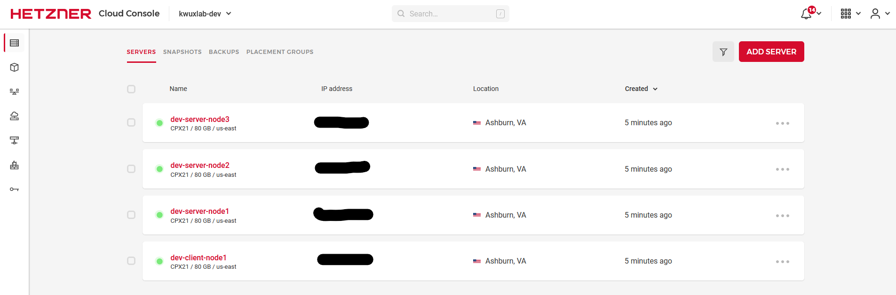

# Kwuxlab / Infrastructure / Terragrunt / Hetzner

This directory contains terragrunt/terraform scripts to create the kwuxlab
development environment within Hetzner Cloud (hcloud).

## Billing Reminder

> WARNING: creating any resources within any external provider may cause charges/fees, which you
> will be obligated to pay. Any billing incurred as a result of following this project is your
> obligation. 
> 
> I recommend destroying any resources when you've finished using them, by running
> `terragrunt destroy`, or, `terragrunt run-all destroy`.

## Pre-requisites

1. The instructions below assume that you've configured your environment as
described in the [parent directory's 'Pre-requisites'](../README.md#pre-requisites-configuration)
instructions.
2. Set your current directory to the environment you'd like to create ([./non-prod](./non-prod))
   ```sh
   cd ./non-prod
   ```
3. Once again, verify that the appropriate environment variables (see the parent's pre-requisites,
and [./.envrc.example](./.envrc.example) for details).
4. Update the project name at [./non-prod/project.hcl](./non-prod/project.hcl).
   > NOTE: by default, the project name is set to `kwuxlab`, and, will be used to create the AWS
   > S3 bucket used for storing terraform's state. Depending on your target AWS Region, you may encounter
   > a name conflict if you keep the default project name!

## Deployment

Now, we'll begin working with Hetzner's API, and creating resources. We'll create a
`non-prod` environment named, `dev`. All resources for this environment are defined
within [./non-prod/dev](./non-prod/dev).

1. First, we'll send your public ssh key to Hetzner, so that they can add it to the 
`authorized_hosts` file to each
node that's created. This will allow you to log-in to the machines without a password, and,
enable Hetzner to *not* send you a plain-text root password via e-mail!
   1. From within the [/non-prod/dev/hcloud/kwuxlab_ssh_key](/non-prod/dev/hcloud/kwuxlab_ssh_key) directory,
      1. If needed, update the path to your public SSH key in 
         [terragrunt.hcl](/non-prod/dev/hcloud/kwuxlab_ssh_key/terragrunt.hcl).
         The default is set to `~/.ssh/id_ed25519.pub`; simply update that variable if needed.
      2. Run `terragrunt plan` (details on this command at [gruntwork's docs](https://terragrunt.gruntwork.io/docs/reference/cli-options/)

         ```sh
         momer@kwuxlab:~/projects/kwuxlab/infrastructure/terragrunt/hetzner/non-prod/dev/hcloud/kwuxlab_ssh_key$ terragrunt plan
         WARN[0000] No double-slash (//) found in source URL /home/momer/projects/kwuxlab/infrastructure/modules/hetzner/hcloud_ssh_key. Relative paths in downloaded Terraform code may not work. 
         
         Terraform used the selected providers to generate the following execution
         plan. Resource actions are indicated with the following symbols:
           + create
         
         Terraform will perform the following actions:
         
           # hcloud_ssh_key.default will be created
           + resource "hcloud_ssh_key" "default" {
               + fingerprint = (known after apply)
               + id          = (known after apply)
               + name        = "Kwuxlab (dev) authorized key"
               + public_key  = <<-EOT
                     ssh-ed25519 AAAAC3NzaC1lZDI1NTE5AAAAID868+ViTp5VLzxuETJICAl95acuECgMXzx8DNqzHXx+ momer@apache.org
                 EOT
             }
         
         Plan: 1 to add, 0 to change, 0 to destroy.
         
         Changes to Outputs:
           + hcloud_ssh_key_fingerprint = (known after apply)
           + hcloud_ssh_key_id          = (known after apply)
           + hcloud_ssh_key_name        = "Kwuxlab (dev) authorized key"
           + hcloud_ssh_key_public_key  = <<-EOT
                 ssh-ed25519 AAAAC3NzaC1lZDI1NTE5AAAAID868+ViTp5VLzxuETJICAl95acuECgMXzx8DNqzHXx+ momer@apache.org
             EOT
         
         ─────────────────────────────────────────────────────────────────────────────
         
         Note: You didn't use the -out option to save this plan, so Terraform can't
         guarantee to take exactly these actions if you run "terraform apply" now.
         ```
      3. Review the output from the `terragrunt plan` command. If the resources being created/updated look acceptable to you
         (the output should look similar to above), then create the resources by running `terragrunt apply`
         (details on this command at [gruntwork's docs](https://terragrunt.gruntwork.io/docs/reference/cli-options/).

         > NOTE: You will have to enter "yes" (without quotes) into the terminal to confirm the approval for
         > creation of these resources. 

         ```sh
         momer@kwuxlab:~/projects/kwuxlab/infrastructure/terragrunt/hetzner/non-prod/dev/hcloud/kwuxlab_ssh_key$ terragrunt apply
         WARN[0000] No double-slash (//) found in source URL /home/momer/projects/kwuxlab/infrastructure/modules/hetzner/hcloud_ssh_key. Relative paths in downloaded Terraform code may not work. 
         
         Terraform used the selected providers to generate the following execution
         plan. Resource actions are indicated with the following symbols:
           + create
         
         Terraform will perform the following actions:
         
           # hcloud_ssh_key.default will be created
           + resource "hcloud_ssh_key" "default" {
               + fingerprint = (known after apply)
               + id          = (known after apply)
               + name        = "Kwuxlab (dev) authorized key"
               + public_key  = <<-EOT
                     ssh-ed25519 AAAAC3NzaC1lZDI1NTE5AAAAID868+ViTp5VLzxuETJICAl95acuECgMXzx8DNqzHXx+ momer@apache.org
                 EOT
             }
         
         Plan: 1 to add, 0 to change, 0 to destroy.
         
         Changes to Outputs:
           + hcloud_ssh_key_fingerprint = (known after apply)
           + hcloud_ssh_key_id          = (known after apply)
           + hcloud_ssh_key_name        = "Kwuxlab (dev) authorized key"
           + hcloud_ssh_key_public_key  = <<-EOT
                 ssh-ed25519 AAAAC3NzaC1lZDI1NTE5AAAAID868+ViTp5VLzxuETJICAl95acuECgMXzx8DNqzHXx+ momer@apache.org
             EOT
         
         Do you want to perform these actions?
           Terraform will perform the actions described above.
           Only 'yes' will be accepted to approve.
         
           Enter a value: yes
         
         hcloud_ssh_key.default: Creating...
         hcloud_ssh_key.default: Creation complete after 0s [id=6490596]
         
         Apply complete! Resources: 1 added, 0 changed, 0 destroyed.
         
         Outputs:
         
         hcloud_ssh_key_fingerprint = "0c:79:01:3b:b3:44:85:62:68:78:42:6f:90:b4:c9:a1"
         hcloud_ssh_key_id = "1234567"
         hcloud_ssh_key_name = "Kwuxlab (dev) authorized key"
         hcloud_ssh_key_public_key = <<EOT
         ssh-ed25519 AAAAC3NzaC1lZDI1NTE5AAAAID868+ViTp5VLzxuETJICAl95acuECgMXzx8DNqzHXx+ momer@apache.org
         
         EOT
         ```
2. Next, we'll create our machines!
   1. From within the [/non-prod/dev/hcloud/kwuxlab_cluster](/non-prod/dev/hcloud/kwuxlab_cluster) directory,
      1. Run `terragrunt plan` (details on this command at [gruntwork's docs](https://terragrunt.gruntwork.io/docs/reference/cli-options/)

         ```sh
         momer@kwuxlab:~/projects/kwuxlab/infrastructure/terragrunt/hetzner/non-prod/dev/hcloud/kwuxlab_cluster$ terragrunt plan
         WARN[0000] No double-slash (//) found in source URL /home/momer/projects/kwuxlab/infrastructure/modules/hetzner/hcloud_ssh_key. Relative paths in downloaded Terraform code may not work.  prefix=[/home/momer/projects/kwuxlab/infrastructure/terragrunt/hetzner/non-prod/dev/hcloud/kwuxlab_ssh_key] 
         WARN[0000] No double-slash (//) found in source URL /home/momer/projects/kwuxlab/infrastructure/modules/hetzner/hcloud_server_cluster. Relative paths in downloaded Terraform code may not work. 
         
         Initializing the backend...
         
         Successfully configured the backend "s3"! Terraform will automatically
         use this backend unless the backend configuration changes.
         
         Initializing provider plugins...
         - Finding hetznercloud/hcloud versions matching "1.33.2"...
         - Installing hetznercloud/hcloud v1.33.2...
         - Installed hetznercloud/hcloud v1.33.2 (signed by a HashiCorp partner, key ID 5219EACB3A77198B)
         
         Partner and community providers are signed by their developers.
         If you'd like to know more about provider signing, you can read about it here:
         https://www.terraform.io/docs/cli/plugins/signing.html
         
         Terraform has created a lock file .terraform.lock.hcl to record the provider
         selections it made above. Include this file in your version control repository
         so that Terraform can guarantee to make the same selections by default when
         you run "terraform init" in the future.
         
         Terraform has been successfully initialized!
         
         You may now begin working with Terraform. Try running "terraform plan" to see
         any changes that are required for your infrastructure. All Terraform commands
         should now work.
         
         If you ever set or change modules or backend configuration for Terraform,
         rerun this command to reinitialize your working directory. If you forget, other
         commands will detect it and remind you to do so if necessary.
         
         Terraform used the selected providers to generate the following execution
         plan. Resource actions are indicated with the following symbols:
           + create
         
         Terraform will perform the following actions:
         
           # hcloud_server.default["client-node1"] will be created
           + resource "hcloud_server" "default" {
               + backup_window              = (known after apply)
               + backups                    = false
               + ...
             }
         
           # hcloud_server.default["server-node1"] will be created
           + resource "hcloud_server" "default" {
               + backup_window              = (known after apply)
               + backups                    = false
               + ...
             }
         
           # hcloud_server.default["server-node2"] will be created
           + resource "hcloud_server" "default" {
               + backup_window              = (known after apply)
               + backups                    = false
               + ...
             }
         
           # hcloud_server.default["server-node3"] will be created
           + resource "hcloud_server" "default" {
               + backup_window              = (known after apply)
               + backups                    = false
               + ...
             }
         
         Plan: 4 to add, 0 to change, 0 to destroy.
         
         Changes to Outputs:
           + all_hetzner_servers  = {
               + client-node1 = {
                   + backup_window              = (known after apply)
                   + backups                    = false
                   + ...
                 }
               + server-node1 = {
                   + backup_window              = (known after apply)
                   + backups                    = false
                   + ...
                 }
               + server-node2 = {
                   + backup_window              = (known after apply)
                   + backups                    = false
                   + ...
                 }
               + server-node3 = {
                   + backup_window              = (known after apply)
                   + backups                    = false
                   + ...
                 }
             }
           + hetzner_server_ids   = [
               + (known after apply),
               + (known after apply),
               + (known after apply),
               + (known after apply),
             ]
           + hetzner_server_names = [
               + "dev-client-node1",
               + "dev-server-node1",
               + "dev-server-node2",
               + "dev-server-node3",
             ]
         
         ─────────────────────────────────────────────────────────────────────────────
         
         Note: You didn't use the -out option to save this plan, so Terraform can't
         guarantee to take exactly these actions if you run "terraform apply" now.

         ```
      2. Review the output from the `terragrunt plan` command. If the resources being created/updated look acceptable to you
         (the output should look similar to above), then create the resources by running `terragrunt apply`
         (details on this command at [gruntwork's docs](https://terragrunt.gruntwork.io/docs/reference/cli-options/).

         > NOTE: You will have to enter "yes" (without quotes) into the terminal to confirm the approval for
         > creation of these resources. 

         ```sh
         momer@kwuxlab:~/projects/kwuxlab/infrastructure/terragrunt/hetzner/non-prod/dev/hcloud/kwuxlab_cluster$ terragrunt apply
         WARN[0000] No double-slash (//) found in source URL /home/momer/projects/kwuxlab/infrastructure/modules/hetzner/hcloud_ssh_key. Relative paths in downloaded Terraform code may not work.  prefix=[/home/momer/projects/kwuxlab/infrastructure/terragrunt/hetzner/non-prod/dev/hcloud/kwuxlab_ssh_key] 
         WARN[0000] No double-slash (//) found in source URL /home/momer/projects/kwuxlab/infrastructure/modules/hetzner/hcloud_server_cluster. Relative paths in downloaded Terraform code may not work. 
         
         Terraform used the selected providers to generate the following execution
         plan. Resource actions are indicated with the following symbols:
           + create
         
         Terraform will perform the following actions:
         
           # hcloud_server.default["client-node1"] will be created
           + resource "hcloud_server" "default" {
               + ...
             }
         
           # hcloud_server.default["server-node1"] will be created
           + resource "hcloud_server" "default" {
               + ...
             }
         
           # hcloud_server.default["server-node2"] will be created
           + resource "hcloud_server" "default" {
               + ...
             }
         
           # hcloud_server.default["server-node3"] will be created
           + resource "hcloud_server" "default" {
               + ...
             }
         
         Plan: 4 to add, 0 to change, 0 to destroy.
         
         Changes to Outputs:
           + all_hetzner_servers  = {
               + ...
             }
           + hetzner_server_ids   = [
               + ...
             ]
           + hetzner_server_names = [
               + ...
             ]
         
         Do you want to perform these actions?
           Terraform will perform the actions described above.
           Only 'yes' will be accepted to approve.
         
           Enter a value: yes
         
         hcloud_server.default["client-node1"]: Creating...
         hcloud_server.default["server-node1"]: Creating...
         hcloud_server.default["server-node2"]: Creating...
         hcloud_server.default["server-node3"]: Creating...
         hcloud_server.default["client-node1"]: Still creating... [10s elapsed]
         hcloud_server.default["server-node2"]: Still creating... [10s elapsed]
         hcloud_server.default["server-node1"]: Still creating... [10s elapsed]
         hcloud_server.default["server-node3"]: Still creating... [10s elapsed]
         hcloud_server.default["server-node3"]: Creation complete after 15s [id=12345675]
         hcloud_server.default["server-node1"]: Creation complete after 16s [id=12345676]
         hcloud_server.default["server-node2"]: Creation complete after 17s [id=12345677]
         hcloud_server.default["client-node1"]: Still creating... [20s elapsed]
         hcloud_server.default["client-node1"]: Creation complete after 21s [id=12345678]
         
         Apply complete! Resources: 4 added, 0 changed, 0 destroyed.
         
         Outputs:
         
         all_hetzner_servers = {
           ...
         }
         hetzner_server_ids = [
           ...
         ]
         hetzner_server_names = [
           ...
         ]
         ```

3. Now, if you log into the Hetzner Cloud console, you should see the machines in your project!

   

4. You're now ready to start using these machines! Head on over to the [ansible](/ansible) directory
to continue!

## Teardown 

Once you're done using the machines, make sure you destroy the resources to stop incurring
billing!

```sh
momer@kwuxlab:~/projects/kwuxlab/infrastructure/terragrunt/hetzner/non-prod/dev/hcloud/kwuxlab_cluster$ terragrunt destroy
WARN[0000] No double-slash (//) found in source URL /home/momer/projects/kwuxlab/infrastructure/modules/hetzner/hcloud_ssh_key. Relative paths in downloaded Terraform code may not work.  prefix=[/home/momer/projects/kwuxlab/infrastructure/terragrunt/hetzner/non-prod/dev/hcloud/kwuxlab_ssh_key] 
WARN[0000] No double-slash (//) found in source URL /home/momer/projects/kwuxlab/infrastructure/modules/hetzner/hcloud_server_cluster. Relative paths in downloaded Terraform code may not work. 
hcloud_server.default["server-node2"]: Refreshing state... [id=12345675]
hcloud_server.default["server-node3"]: Refreshing state... [id=12345676]
hcloud_server.default["server-node1"]: Refreshing state... [id=12345677]
hcloud_server.default["client-node1"]: Refreshing state... [id=12345678]

Terraform used the selected providers to generate the following execution
plan. Resource actions are indicated with the following symbols:
  - destroy

Terraform will perform the following actions:

  # hcloud_server.default["client-node1"] will be destroyed
  - resource "hcloud_server" "default" {
      - ...
    }

  # hcloud_server.default["server-node1"] will be destroyed
  - resource "hcloud_server" "default" {
      - ...
    }

  # hcloud_server.default["server-node2"] will be destroyed
  - resource "hcloud_server" "default" {
      - ...
    }

  # hcloud_server.default["server-node3"] will be destroyed
  - resource "hcloud_server" "default" {
      - ...
    }

Plan: 0 to add, 0 to change, 4 to destroy.

Changes to Outputs:
  - all_hetzner_servers  = {
      - ...
    } -> null
  - hetzner_server_ids   = [
      - ...
    ] -> null
  - hetzner_server_names = [
      - ...
    ] -> null

Do you really want to destroy all resources?
  Terraform will destroy all your managed infrastructure, as shown above.
  There is no undo. Only 'yes' will be accepted to confirm.

  Enter a value: yes

hcloud_server.default["server-node1"]: Destroying... [id=12345675]
hcloud_server.default["client-node1"]: Destroying... [id=12345676]
hcloud_server.default["server-node2"]: Destroying... [id=12345677]
hcloud_server.default["server-node3"]: Destroying... [id=12345678]
hcloud_server.default["client-node1"]: Destruction complete after 1s
hcloud_server.default["server-node2"]: Destruction complete after 1s
hcloud_server.default["server-node1"]: Destruction complete after 1s
hcloud_server.default["server-node3"]: Destruction complete after 1s

Destroy complete! Resources: 4 destroyed.
```
